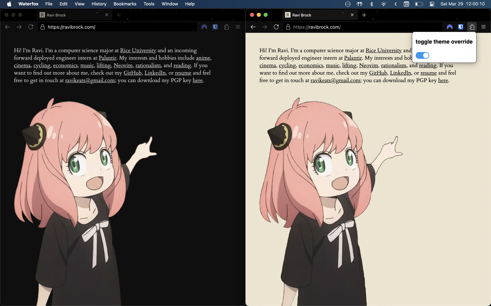

# Theme Spoofer
Super simple extension to toggle theme for websites that use `@media (prefers-color-scheme: dark)`. Won't work right if websites do fancy stuff with JS for theming (c.f. [gwern.net](https://gwern.net/)).

## Install instructions (regular)
1. Download the latest `.xpi` file from [releases](https://github.com/ravibrock/theme-spoofer/releases).
2. Go to [about:addons](about:addons) in Firefox.
3. Click on **install add-on from file**.
4. Select the file you downloaded and go through the normal steps.

## Install instructions (developer)
1. Go to [addons.mozilla.org/developers](https://addons.mozilla.org/en-US/developers/).
2. Sign in with your Firefox account.
3. Click **"Submit a New Add-on"** → choose **"On your own"**, then **"Unlisted"**.
4. Zip your extension folder (it must include `manifest.json` at the root) with `zip -r theme-spoofer.zip .`.
5. Upload the .zip file to AMO.
6. Once validation passes, download the signed .xpi file.
7. Open Firefox, drag the .xpi into the browser window, and confirm installation.
